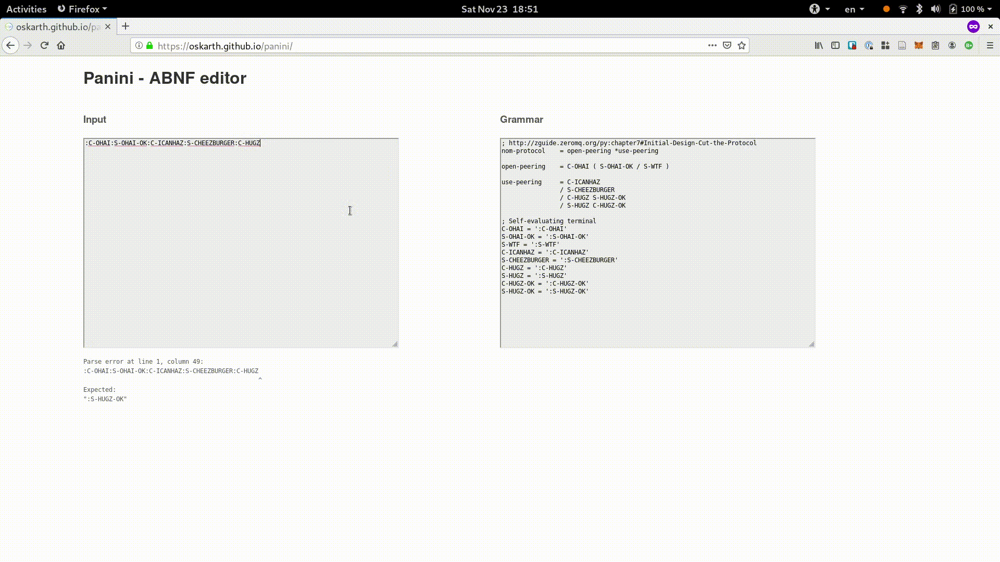

# Panini

Panini is a live ABNF editor based on Instaparse.



See it running live [here](https://oskarth.github.io/panini/).

## Development

To get an interactive development environment run:

    lein fig:build

This will auto compile and send all changes to the browser without the
need to reload. After the compilation process is complete, you will
get a Browser Connected REPL. An easy way to try it is:

    (js/alert "Am I connected?")

and you should see an alert in the browser window.

To clean all compiled files:

	lein clean

To create a production build run:

	lein clean
	lein fig:min

NOTE: Use `lein fig:minsimple` for now due to some issues with `pprint` and advanced optimizations.

## Deployment

Create a production build (`dev-main.js`) as above and copy assets to root folder:

```
cp resources/public/index.html .
cp resources/public/cljs-out/dev-main.js cljs-out
cp resources/public/css/style.css css/
```

## License

Copyright © 2019 oskarth

Distributed under the Eclipse Public License either version 1.0 or (at your option) any later version.
